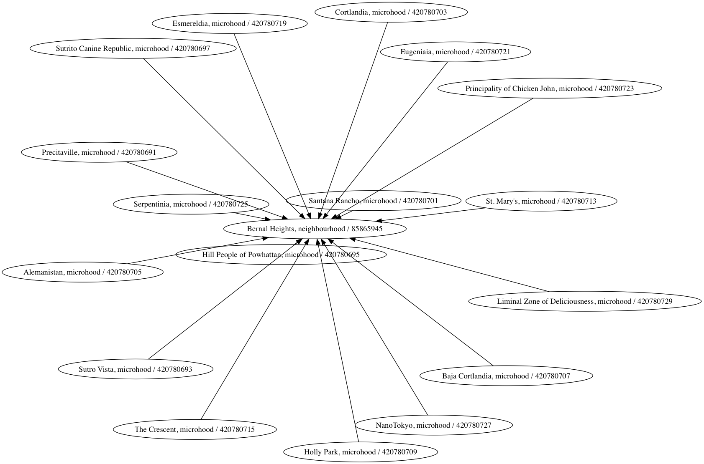

# go-whosonfirst-graphviz

Tools for working with Who's On First documents and graphviz.

## Install

You will need to have both `Go` (specifically a version of Go more recent than 1.7 so let's just assume you need [Go 1.9](https://golang.org/dl/) or higher) and the `make` programs installed on your computer. Assuming you do just type:

```
make bin
```

All of this package's dependencies are bundled with the code in the `vendor` directory.

## Tools

### wof-graph

Generate a `dot` file from a collection of Who's On First documents.

```
./bin/wof-graph -h
Usage of ./bin/wof-graph:
  -belongs-to value
    	One or more WOF ID that a record should belong to
  -exclude value
    	One or more placetypes to exclude
  -mode string
    	Currently only '-mode repo' is supported (default "repo")
  -superseded_by
    	Include superseded_by relationships
  -supersedes
    	Include supersedes relationships
```	

For example, here are all the descendants of [San Francisco](https://spelunker.whosonfirst.org/id/85922583/descendants/?exclude=nullisland):

```
$> ./bin/wof-graph -belongs-to 85922583 /usr/local/data/whosonfirst-data > sf.dot
$> dot -Kfdp -Tpng sf.dot -osf.png
```

Which produces a 112MB PNG file, that is 65,000 pixels on one side, so here's the neighbourhoood of [Bernal Heights](https://spelunker.whosonfirst.org/id/85865945/descendants/?exclude=nullisland) instead:

```
./bin/wof-graph -belongs-to 85865945 /usr/local/data/whosonfirst-data > bernal.dot
dot -Kfdp -Tsvg bernal.dot -obernal.png
```



As of this writing, the following records are not included:

* Alt files
* Records that have been deprecated

## See also

* https://github.com/awalterschulze/gographviz
* https://www.graphviz.org/doc/info/command.html
* https://graphs.grevian.org/example